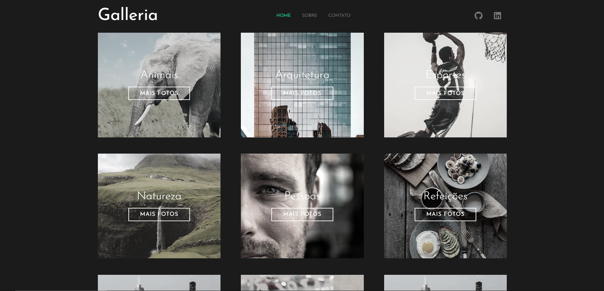

# galleria
<h1 align="center">Galleria</h1>

 Esse projeto foi feito com o objetivo de facilitar a busca por fotos gratuitas.  

  <a href="#-tecnologias">Tecnologias</a>&nbsp;&nbsp;&nbsp;|&nbsp;&nbsp;&nbsp;
  <a href="#-projeto">Projeto</a>&nbsp;&nbsp;&nbsp;|&nbsp;&nbsp;&nbsp;
  <a href="#memo-licença">Licença</a>

  

 

 
    

## 🚀 Tecnologias

-Nesse projeto foi utilizado as seguintes tecnologias:

-SASS  
-HTML   
-Github  

## 💻 Projeto

O projeto tem como objetivo ajudar a encontrar fotos gratuitas referentes alguns temas comuns a partir de uma biblioteca com layout bem intuitivo e feito com SASS. 

- [Visite o projeto online](https://helenapl145.github.io/Galleria/)

Esse projeto está sob a licença MIT.

---

Feito com ♥ by Helena Lima

